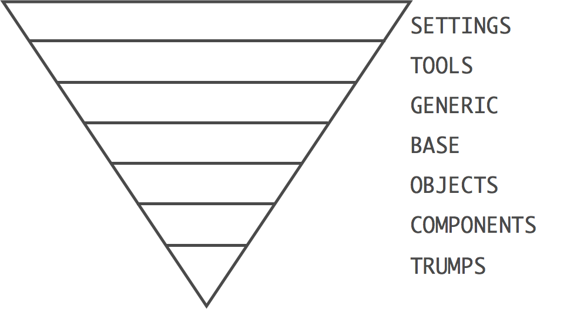

# The helpless developer's guide to InuitCSS
Demystifying the InuitCSS experience.

[The official guide](https://github.com/inuitcss/getting-started) makes some big assumptions when it comes to explaining how to use the latest, ultra-modular version of [InuitCSS](https://github.com/inuitcss). This document attempts to expose the documentation in a way that is easier to understand.

## Philosophy
InuitCSS is based on the Inverted Triangle philiosphy of CSS inheritence, an attempt to express best practice in large-scale web projects. The rules at the top should be extremely generic, while those at the bottom should be ultra-specific overrides.



* **Settings:** Global variables, site-wide settings, config switches, etc.
* **Tools:** Site-wide mixins and functions.
* **Generic:** Low-specificity, far-reaching rulesets (e.g. resets, normalise.css, box-sizing).
* **Base:** Unclassed HTML elements (Directly selects element typs e.g. a {}, blockquote {}, address {}).
* **Objects:** Objects, abstractions, and design patterns (e.g. .media {}). Cosmetic-free.
* **Components:** Discrete, complete chunks of UI (e.g. .carousel {}). Cosmetically-designed components. This is the one layer that inuitcss doesn’t get involved with.
* **Trumps:** High-specificity, very explicit selectors. Overrides and helper classes (e.g. .hidden {}).


These links might shed some light on the whole thing:
* <http://csswizardry.net/talks/2014/11/itcss-dafed.pdf> - comes up on Google when you search for "ITCSS".
* <http://www.creativebloq.com/web-design/manage-large-scale-web-projects-new-css-architecture-itcss-41514731> - Interview with Harry Roberts on ITCSS


## Practical

InuitCSS isn't like Bootstrap or Zurb Foundation. It won't give you an out-of-the-box layout, or nicely styled buttons. It's a bunch of helper functions, mixins and classes, written in Sass, that will help you to build your own systems.


## Modules
InuitCSS is *increadibly* modular and has all documentation inline. While this means that you only ever pull in what you need, and there's information inline, it means that getting a  high-level overview is extremely frustrating. This guide attempts to address that.

The following list breaks things up according to the inverted triangle philosophy, but notice that each module is prefixed with something like `inuit-defaults`. This is a bower or npm package name. A bower or npm package might contain more than one module. Then after the '/' in each group is the triangle stack level, e.g. `settings.xxxxxx`, detailing *where* in the triangle it affects, and, after the '.', the effect name `nnnnnn.default`, describing what it *does*.

So, `inuit-tools-widths/tools.widths` belongs to the `inuit-tools-widths` package, affects the `tools` layer of the triangle and provides `widths` functionality.

Meanwhile, `inuit-page/base.page` belongs to the `inuit-page` package, affects the `base` layer and provides functionality that deals with a `page`.

### Module documentation
* **[Settings layer](settings.md)** - Global variables, site-wide settings, config switches, etc.
    * [settings.default](settings.md#settingsdefault)
    * [settings.responsive](settings.md#settingsresponsive)
* **[Tools layer](tools.md)** - Site-wide mixins and functions.
    * [tools.functions](tools.md#toolsfunctions)
    * [tools.mixins](tools.md#toolsmixins)
    * [tools.reponsive](tools.md#toolsresponsive)
    * [tools.widths](tools.md#toolswidths)
* **[Generic layer](generic.md)** - Low-specificity, far-reaching rulesets (e.g. resets, normalise.css, box-sizing).
    * [generic.reset](generic.md#genericreset)
    * [generic.normalize](generic.md#genericnormalize)
    * [generic.box-sizing](generic.md#genericbox-sizing)
    * [generic.shared](generic.md#genericshared)
* **[Base layer](base.md)** - Unclassed HTML elements (Directly selects element typs e.g. a {}, blockquote {}, address {}).
    * [base.page](base.md#basepage)
    * [base.headings](base.md#baseheadings)
    * [base.images](base.md#baseimages)
    * [base.paragraphs](base.md#baseparagraphs)
    * [base.lists](base.md#baselists)
* **[Objects layer](objects.md)** - Objects, abstractions, and design patterns (e.g. .media {}). Cosmetic-free.
    * [objects.buttons](objects.md#objectsbuttons)
    * [objects.tables](objects.md#objectstables)
    * [objects.pack](objects.md#objectspack)
    * [objects.media](objects.md#objectsmedia)
    * [objects.tabs](objects.md#objectstabs)
    * [objects.flag](objects.md#objectsflag)
    * [objects.box](objects.md#objectsbox)
    * [objects.list-block](objects.md#objectslist-block)
    * [objects.list-ui](objects.md#objectslist-ui)
    * [objects.list-inline](objects.md#objectslist-inline)
    * [objects.block](objects.md#objectsblock)
    * [objects.layout](objects.md#objectslayout)
    * [objects.list-bare](objects.md#objectslistbare)
* **Components layer** - Discrete, complete chunks of UI (e.g. .carousel {}, .card{}). Cosmetically-designed components. Inuit doesn't offer anything in this layer. This is for your own visually-designed components.
* **[Trumps layer](trumps.md)** - High-specificity, very explicit selectors. Overrides and helper classes (e.g. .hidden {}).
    * [trumps.widths-responsive](trumps.md#trumpswidths-responsive)
    * [trumps.spacing-responsive](trumps.md#trumpsspacing-responsive)
    * [trumps.spacing](trumps.md#trumpsspacing)
    * [trumps.clearfix](trumps.md#trumpsclearfix)
    * [trumps.headings](trumps.md#trumpsheadings)
    * [trumps.print](trumps.md#trumpsprint)
    * [trumps.widths](trumps.md#trumpswidths)


## Installation
You get an initial install of InuitCSS going via the [Inuit Starter Kit](https://github.com/inuitcss/starter-kit):

`$ bower install --save-dev inuit-starter-kit`

This will install several of the required modules that are essential to any InuitCSS project.

You'll then need to import the following into your build system's main Sass file:

```
// SETTINGS
@import "bower_components/inuit-defaults/settings.defaults";

// TOOLS
@import "bower_components/inuit-functions/tools.functions";
@import "bower_components/inuit-mixins/tools.mixins";

// GENERIC
@import "bower_components/inuit-normalize/generic.normalize";
@import "bower_components/inuit-box-sizing/generic.box-sizing";

// BASE
@import "bower_components/inuit-page/base.page";

// OBJECTS

// COMPONENTS

// TRUMPS
```

It's a really great idea to break your components into the ITCSS layers as you go along, as in the above `@import` example. It'll help you realize what layer you're working at.
